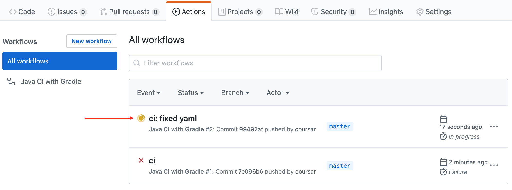
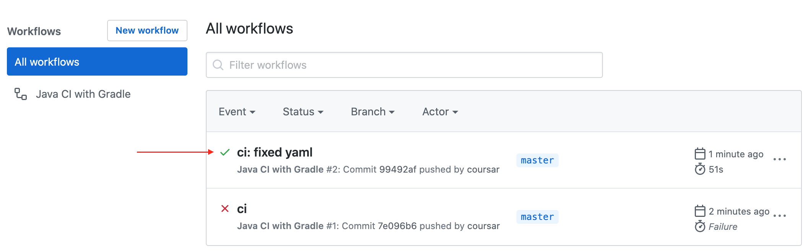

# Домашнее задание к занятию «2.1. Автотесты, работа с отладчиком и Continuous Integration»

## Задача №1. Максимальное покрытие

Вам нужно взять функцию расчёта комиссии при переводе и написать для неё автотесты:


Подключите JUnit4 и JaCoCo. Добейтесь того, чтобы покрытие кода по branch было не менее 80 %:


Итог: у вас должен быть репозиторий на GitHub, в котором будет ваш Gradle-проект. Автотесты также должны храниться в репозитории.

## Задача №2. CI

Работая в команде, вы будете запускать тесты не на своём компьютере, а при каждом пуше в облаке. Так будет видно, кто сломал сборку, а кто прислал нерабочий PR (Pull-Request). В этом вся прелесть командной работы 😈.

Мы настроим CI на базе GitHub Actions, уже встроенной в GitHub-системы.

После того как вы сделали задачу №1, перейдите в ваш репозиторий на вкладку GitHub Actions.

GitHub Actions предложит вам один или несколько Workflow по умолчанию, но лучше выбрать «Setup a workflow yourself»

В открывшемся окне делаем по шагам:
1. Меняем имя файла на `gradle.yml`.
2. Меняем весь код на тот что ниже.
3. Нажимаем «Start Commit».
4. Нажимаем «Commit new file».

Код для `gradle.yml` скопируйте и замените целиком. Не переписывайте вручную:

```yml
name: Kotlin CI with Gradle

on:
  push:
    branches: '*'
  pull_request:
    branches: '*'

jobs:
  build:

    runs-on: ubuntu-latest

    steps:
    - uses: actions/checkout@v2
    - name: Set up JDK 1.8
      uses: actions/setup-java@v1
      with:
        java-version: 1.8
    - name: Grant execute permission for gradlew
      run: chmod +x gradlew
    - name: Build with Gradle
      run: ./gradlew build --info

```

«Everything as code» и «Configuration as code» — большинство современных CI-систем следуют этому подходу, когда все необходимые настройки хранятся в текстовом файле в самом репозитории. В случае GitHub Actions в вашем репозитории создастся файл `./github/workflows/gradle.yml`, поэтому не забудьте сделать `git pull`, чтобы он попал и в ваш локальный репозиторий.

После того как вы закоммитите корректный файл конфигурации, на вкладке GitHub Actions можно посмотреть прогресс выполнения:



Через какое-то время получим общий итог. PASS — зелёный флажок или FAIL — красный крестик:



### Задача

Подключить к вашему репозиторию GitHub Actions, следуя инструкции выше.

Чтобы удостовериться, что CI работает, добавьте коммит, ломающий сборку: выставьте в тестах неправильное ожидаемое значение. Убедитесь, что после Push вам покажут эту проблему.

Итог:
1. У вас должен быть репозиторий на GitHub, в котором расположен ваш Gradle-проект.
2. К репозиторию должен быть подключён GitHub Actions.
3. В истории должен быть хотя бы один коммит, ломающий сборку.